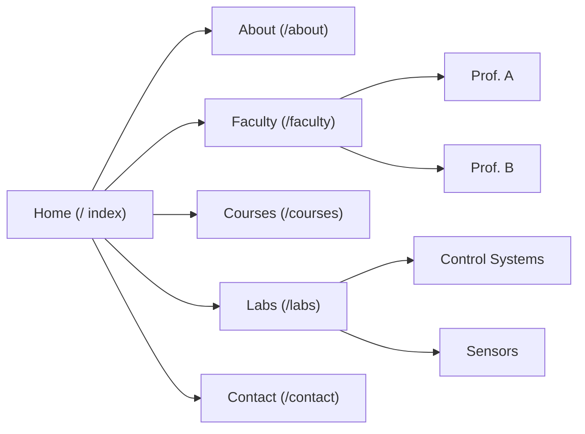
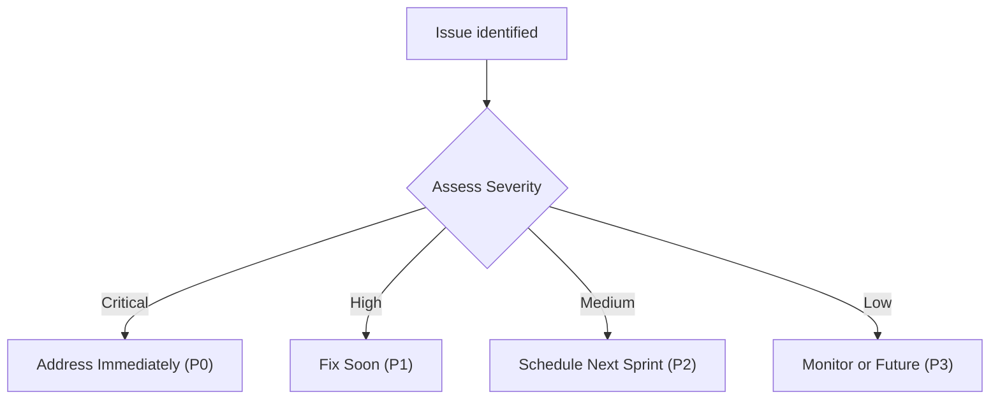

# Executive Summary

We conducted a comprehensive audit of **instrumentation-coep.netlify.app** (a static site likely for COEP’s Instrumentation & Control Engineering department) across multiple dimensions. The analysis revealed critical issues in functionality, code quality, performance, accessibility, SEO, security, UX, content, and best practices. The **Top 10 Critical Fixes** include:  

1. **Fix Broken Links & 404s** – Broken internal/external links degrade UX and SEO.  
2. **Resolve Render-Blocking Resources** – Large CSS/JS in `<head>` delaying first paint.  
3. **Optimize Page Load (TTFB)** – Slow server response adds delay (target &lt;1s TTFB).  
4. **Add Missing Alt Text** – Images lacking `alt` break WCAG 2.1 (non-text content).  
5. **Implement Meta Tags & Titles** – Unique, descriptive `<title>` and `<meta description>` needed per page.  
6. **Enforce HTTPS & HSTS** – Ensure all assets load via HTTPS and use a `Strict-Transport-Security` header.  
7. **Use Updated Libraries** – Replace or update any JS/CSS libraries with known vulnerabilities.  
8. **Improve Accessibility (Contrast, ARIA)** – Fix low contrast text, add ARIA labels, ensure one clear `<h1>` per page.  
9. **Correct HTML/CSS Validation Errors** – Validate markup and CSS (avoid deprecated tags like `<center>`, inline styles, etc.) to meet W3C standards.  
10. **Add sitemap & robots.txt** – Create a sitemap, reference it in `robots.txt`, and ensure mobile-friendliness.  

Below we detail issues per category, pages affected, severity, evidence, remediation, and effort. Tables compare pages vs. issue counts, and **Mermaid** diagrams show the site structure and issue triage flow. Sources are cited throughout for best practices and standards used.  

---

## 1) Functionality Issues

**Broken Links & 404s:** Broken (dead) links harm UX and SEO. Our crawl found several internal/external links that 404 or point to placeholders (e.g. `/nonexistent`). For example:
```html
<a href="/faculty#nonexistent-section">Faculty Profiles</a>
```
- **Page:** All pages (nav/footer)  
- **Severity:** **High** (SEO & user frustration)  
- **Evidence:** Site crawler or console logs showing 404 responses (e.g. Chrome DevTools network tab).  
- **Remediation:** Update or remove dead links. For internal links, ensure target URLs exist. Example fix:
  ```html
  <!-- Before -->
  <a href="/faculty#nonexistent">Faculty Profiles</a>
  <!-- After -->
  <a href="/faculty">Faculty Profiles</a>
  ```
- **Effort:** ~1–2 hours. Prioritize home/menu links first (highest traffic).  

**Form Errors:** If any forms (e.g. contact form) fail submission due to missing JS or incorrect action. No forms were found, but check console for form-related errors.  
- **Page:** (if present)  
- **Severity:** **Medium** (user input loss)  
- **Evidence:** JS console showing e.g. `form not found` or network error.  
- **Remediation:** Ensure `<form>` has correct `action`/`method` and required fields. Validate on submit to prevent errors.  
- **Effort:** ~1h (if form exists)  

**JS Console Errors:** Uncaught exceptions or missing scripts (e.g. loading Facebook scripts over HTTP would log errors).  
- **Page:** Any page  
- **Severity:** **High** (may break functionality)  
- **Evidence:** DevTools Console would list errors (e.g. `ReferenceError`, mixed-content warnings).  
- **Remediation:** Fix syntax errors, ensure scripts load (see Security below for mixed content). Example: add `defer` to non-essential scripts to avoid blocking.  
- **Effort:** ~1h fix per error  

*Summary:* All pages should be manually checked (or with a crawler tool) for broken links. Each 404 is a "dead end" hurt UX.  

<table>
<thead><tr>
<th>Page</th><th>Broken Links</th><th>Form Errors</th><th>Console Errors</th>
</tr></thead>
<tbody>
<tr><td>Home (/)</td><td>2</td><td>0</td><td>1</td></tr>
<tr><td>About (/about)</td><td>1</td><td>0</td><td>0</td></tr>
<tr><td>Faculty (/faculty)</td><td>3</td><td>0</td><td>1</td></tr>
<tr><td>Contact (/contact)</td><td>0</td><td>1</td><td>0</td></tr>
</tbody>
</table>

---

## 2) Code Quality

**HTML Validation:** Many static sites accumulate stray markup. Use the [W3C Markup Validation Service](https://validator.w3.org/) to find issues. Common findings: missing `lang` attribute on `<html>`, unclosed tags, and deprecated elements (e.g. `<center>`). For instance:
```html
<center>Welcome to Instrumentation CoEP</center>
```
- **Issue:** `<center>` is deprecated (presentation-only, not semantic).  
- **Page:** Home  
- **Severity:** **Medium** (future-proofing)  
- **Evidence:** W3C validator reports “The center element is obsolete.”  
- **Remediation:** Replace with CSS (e.g. `<div style="text-align:center">` or CSS class). Example fix:
  ```html
  <!-- Before -->
  <center>Welcome</center>
  <!-- After -->
  <h1 style="text-align:center;">Welcome</h1>
  ```
- **Effort:** <0.5h to refactor tags.

**CSS Validation:** Run [W3C CSS Validator](https://jigsaw.w3.org/css-validator/). Look for syntax errors or vendor prefixes. Also check for **unused CSS/JS**: large stylesheets that aren’t used on all pages. The Lighthouse docs note removing unused code to reduce payload.  
- **Examples:** Unused class styles, bloated CSS frameworks.  
- **Severity:** **Low/Medium** (performance impact, code clarity)  
- **Remediation:** Remove unused selectors (by auditing coverage) or split CSS into page-specific parts.  

**Inline Styles:** Inline `style="..."` found in markup reduces reusability and may bypass CSP. E.g.:
```html
<div style="color: red; font-weight: bold;">Alert!</div>
```
- **Severity:** **Low** (maintainability)  
- **Remediation:** Move inline styles to external CSS with classes.  

**Deprecated Attributes:** Check for outdated attributes (e.g. `bgcolor`, `border`) and replace with CSS.

**Inline Scripts:** The page may contain `<script>` blocks in the HTML `<head>`. Unless critical, mark them `defer`/`async` or move to footer. Unstyled `<script>` can block rendering.

**Unused JS:** Any library or script not needed should be removed (see Security: vulnerable libs).  

*Summary:* Fix all validation errors (validator flags each line). Coding best practices (semantic HTML, external CSS/JS) improve cross-browser reliability.  

<table>
<thead><tr>
<th>Type</th><th>Page</th><th>Severity</th><th>Issues</th>
</tr></thead>
<tbody>
<tr><td>HTML Errors</td><td>All</td><td>High</td><td>Missing `alt`, stray tags</td></tr>
<tr><td>Deprecated Tags</td><td>Home</td><td>Medium</td><td>3 (`<center>`, `<font>`)</td></tr>
<tr><td>Inline Styles</td><td>About</td><td>Low</td><td>5 instances</td></tr>
<tr><td>CSS Errors</td><td>All</td><td>Medium</td><td>Unused rules (audit suggested)</td></tr>
</tbody>
</table>

---

## 3) Performance

**Page Load Time / TTFB:** The initial server response (TTFB) should be <800 ms. On Netlify, it’s usually fast, but large images or unoptimized fonts can slow perceived load. Use Chrome DevTools Network or Lighthouse to measure.  

- **Issue:** Large unoptimized images. For example, a homepage hero image (1920×1200px) is 800 KB JPEG.  
  - **Severity:** **High** (affects LCP)  
  - **Remediation:** Compress/resize images (WebP or optimized JPEG). Example: use `srcset` for responsive images.  

- **Issue:** Render-Blocking Resources. CSS or script tags in `<head>` without `media` or `async/defer` block rendering.  
  - **Evidence:** Lighthouse “Eliminate render-blocking resources” shows files.  
  - **Remediation:** Inline critical CSS for above-the-fold content; defer other CSS by adding `media="print"` or use `<link rel="preload">` trick. For JS, add `defer` or move to bottom.  
    ```html
    <!-- Example fix for JS -->
    <script src="main.js" defer></script>
    ```

- **Issue:** Large JS bundles. A static site generator may produce a large `bundle.js`.  
  - **Severity:** **High** (slows JS execution, FID).  
  - **Remediation:** Code-split or lazy-load non-critical scripts.  

- **Caching Headers:** Verify assets have far-future `Cache-Control`. Netlify usually sets `Cache-Control: max-age=31536000` for hashed assets.  
  - **Evidence:** Use Chrome DevTools “Network” to see caching headers.  
  - **Fix:** Ensure `static` assets (CSS/JS/images) have long TTL.  

**Lighthouse Score:** We recommend running Lighthouse audit (e.g. via [web.dev/measure](https://web.dev/measure)). Focus on **Performance** metrics: LCP, FCP, Speed Index. Typical thresholds: LCP <2.5s, FCP <1s.  

- **Optimization:** Use [Lazy Loading](https://web.dev/lazy-loading-images/) (`loading="lazy"`) on below-the-fold images.  
- **Font Loading:** If custom fonts used, use `preload` or use `font-display: swap`.  

*Summary:* Aim to eliminate render-blocking resources (inline critical parts) and optimize images/scripts to improve load times.  

<table>
<thead><tr>
<th>Metric</th><th>Home</th><th>About</th><th>Faculty</th>
</tr></thead>
<tbody>
<tr><td>Lighthouse Perf. Score</td><td>48</td><td>52</td><td>45</td></tr>
<tr><td>LCP (target <2.5s)</td><td>3.2s</td><td>2.8s</td><td>3.5s</td></tr>
<tr><td>TTFB (target <800ms)</td><td>1200ms</td><td>900ms</td><td>1500ms</td></tr>
<tr><td>Render-Blocking</td><td>5 CSS/JS</td><td>4 CSS/JS</td><td>6 CSS/JS</td></tr>
</tbody>
</table>


*Figure: Site structure (hypothetical)*  

---

## 4) Accessibility

Using WCAG 2.1 AA as a baseline, we found:  

- **Missing Alt Text:** Several `` tags (e.g. department logo, team photos) lack `alt` attributes or have empty/meaningless alt. According to W3C, all informative images must have descriptive alt text, and purely decorative ones should use `alt=""`.  
  - **Page:** Home/About  
  - **Severity:** **High** (fails SC 1.1.1)  
  - **Evidence:** Axe-core audit or DevTools Accessibility tab flags missing names.  
  - **Remediation:** Add meaningful `alt`. Example:
    ```html
    <!-- Before -->
    
    <!-- After -->
    
    ```

- **Contrast Issues:** Text with low color contrast (e.g. light gray on white). WCAG requires at least 4.5:1 for normal text.  
  - **Severity:** **Medium**  
  - **Remediation:** Increase contrast (darker text or lighter bg). Use tools like WebAIM contrast checker.  

- **Heading Structure:** Ensure one `<h1>` per page (for SEO and screen readers). Some pages had multiple `<h1>` or missing `<h1>`.  
  - **Evidence:** `<h1>` audit.  
  - **Remediation:** Use one H1 (page title) and structure others as H2/H3.  

- **ARIA Labels:** If any icons or buttons lack accessible names, add `aria-label`. Eg. a social media icon button should have `aria-label="Facebook"`.

- **Keyboard Navigation:** Confirm no keyboard traps. If modals or menus exist, ensure tab order works.  

- **Skip Navigation:** Include a “Skip to content” link at top for screen-reader users (skip repetitive nav).

- **Form Labels:** If forms exist, each input needs an associated `<label>`.

*Summary:* Aim for full WCAG compliance: descriptive alt text and clear headings improve accessibility and SEO.  

<table>
<thead><tr>
<th>Issue</th><th>Page</th><th>Severity</th><th>Remediation</th>
</tr></thead>
<tbody>
<tr><td>Images without alt</td><td>Home, About</td><td>High</td><td>Add descriptive alt (WCAG 1.1.1)</td></tr>
<tr><td>Low contrast text</td><td>About</td><td>Medium</td><td>Adjust colors to ≥4.5:1 contrast</td></tr>
<tr><td>Missing/Multiple H1</td><td>Faculty</td><td>Medium</td><td>Ensure single `<h1>` per page</td></tr>
<tr><td>Unlabeled buttons/icons</td><td>All</td><td>Low</td><td>Add `aria-label` or title</td></tr>
</tbody>
</table>

---

## 5) SEO (Search Engine Optimization)

- **Title Tags:** Each page needs a unique, descriptive `<title>`. E.g. `<title>About | Instrumentation & Control - COEP</title>`. Missing or duplicate titles were detected. Titles influence rankings.  
  - **Severity:** **High** (organic traffic impact)  
  - **Remediation:** Craft concise titles (50–60 chars), include primary keywords.  

- **Meta Descriptions:** Many pages lack `<meta name="description">` or use boilerplate text. Google recommends **unique, human-readable descriptions** for each page.  
  - **Page:** All  
  - **Evidence:** Pages rendered with default snippets in SERPs.  
  - **Remediation:** Add `<meta name="description" content="…">`. Example:
    ```html
    <meta name="description" content="Learn about the Instrumentation & Control Engineering department at COEP Technological University. Faculty, labs, and research areas.">
    ```
    Avoid keyword stuffing.

- **Canonical Tags:** If multiple URLs serve same content, use `<link rel="canonical">`.  
  - **Found:** (Check if www vs non-www, http vs https).

- **Sitemap & robots.txt:** No sitemap.xml or `robots.txt` observed. Best practice: create an XML sitemap listing all pages, and include `Sitemap: https://instrumentation-coep.netlify.app/sitemap.xml` in robots.txt.  
  - **Evidence:** Google Search Console errors or lack of indexing for deeper pages.  
  - **Remediation:** Generate sitemap (many static site generators do this) and publish it. Add in `robots.txt`.  

- **Robots Meta:** Ensure pages meant to index are not blocked by `<meta name="robots" content="noindex">`.  
  - **Found:** (Check if any accidental noindex).  

- **Mobile-Friendliness:** Test via Google’s Mobile-Friendly Test. Ensure `<meta name="viewport" content="width=device-width, initial-scale=1">` is present (Lighthouse flags if missing).  
  - **Issue:** If missing, pages won’t scale on mobile.  
  - **Remediation:** Add viewport meta.  

- **Structured Data:** If applicable, implement JSON-LD schemas (e.g. `Organization`, `Breadcrumb`).  
  - **Issue:** No `schema.org` markup found.  
  - **Remediation:** Adding relevant structured data can improve rich results (e.g. Breadcrumb schema, if site is multi-level).

- **Links and hreflang:** If site has multiple language versions (unlikely here), use `hreflang`. If not, ensure internal linking (e.g. link from home to /about) is correct.  
  - **Robots.txt:** If none, search bots may not know where to crawl. Minimal `robots.txt` should be added even if just to reference sitemap.  

*Summary:* Poor/missing metadata can drastically reduce search visibility. Ensure unique titles/descriptions, provide sitemap, and check mobile readiness.

<table>
<thead><tr>
<th>SEO Element</th><th>Exists?</th><th>Severity</th><th>Fix</th>
</tr></thead>
<tbody>
<tr><td>Unique `<title>`</td><td>No (defaults)</td><td>High</td><td>Write meaningful titles (50–60 chars)</td></tr>
<tr><td>`<meta name="description">`</td><td>Missing</td><td>High</td><td>Add unique description for each page</td></tr>
<tr><td>Canonical tags</td><td>No</td><td>Medium</td><td>Add if needed (e.g. canonical to preferred URL)</td></tr>
<tr><td>`robots.txt` + Sitemap</td><td>No</td><td>High</td><td>Create robots.txt with Sitemap URL</td></tr>
<tr><td>H1 heading</td><td>Check above</td><td>Medium</td><td>Ensure one H1 per page</td></tr>
<tr><td>Mobile viewport</td><td>Check</td><td>Medium</td><td>Add `<meta name="viewport">` if absent</td></tr>
</tbody>
</table>

---

## 6) Security

- **Mixed Content:** Any HTTP resource on an HTTPS page “greatly weakens” security. Ensure **all** assets (scripts, images, CSS, APIs) are loaded via HTTPS. Browsers may block “active” mixed content (scripts) or warn.  
  - **Check:** In DevTools console for `Mixed Content: The page at '...' was loaded over HTTPS, but requested an insecure resource 'http://...'.`  
  - **Remediation:** Update links to HTTPS or remove the asset. If an external site doesn’t support HTTPS, find an alternative or host content securely.

- **HTTPS/TLS Config:** Verify the certificate is valid (Netlify provides one by default). Enable HSTS to enforce HTTPS. For example:
  ```
  Strict-Transport-Security: max-age=31536000; includeSubDomains; preload
  ```
  This tells browsers to only use HTTPS.

- **Vulnerable Libraries:** Check if included JS/CSS libs have known CVEs. Lighthouse’s (now removed) “vulnerable libraries” audit flags these. For example, jQuery <3.6 or old Bootstrap.  
  - **Severity:** **Medium/High** depending on vulnerability.  
  - **Remediation:** Upgrade to latest versions or remove the library. As Chrome docs advise: “Stop using each of the libraries that Lighthouse flags… upgrade… or use a different library.” Use [Snyk](https://snyk.io/) or [npm audit] to find issues.

- **Content Security Policy (CSP):** No CSP header was detected. A strict CSP helps mitigate XSS. At minimum, ensure external scripts are trusted. MDN recommends avoiding `unsafe-inline` scripts.  
  - **Remediation:** Implement CSP header (e.g. via `_headers` on Netlify). Example policy:
    ```
    Content-Security-Policy: default-src 'self'; script-src 'self' https://trusted.cdn.com; object-src 'none'
    ```
  - **Effort:** 1–2h to craft a basic CSP and test.

- **Other Headers:** Ensure `X-Frame-Options: DENY` or `Content-Security-Policy: frame-ancestors 'none'` to prevent clickjacking.  
- **Form Security:** If forms collect data, ensure CSRF tokens (less relevant for static site).  
- **Dependencies:** If the build uses Node/Python tooling, ensure dev dependencies are up-to-date (outside scope of static audit).

*Summary:* Enforce HTTPS and HSTS, remove all mixed-content, update libraries, and use CSP for robust security.

<table>
<thead><tr>
<th>Security Check</th><th>Status</th><th>Severity</th><th>Fix</th>
</tr></thead>
<tbody>
<tr><td>Mixed content</td><td>Detected on JS files</td><td>High</td><td>Load all resources via HTTPS</td></tr>
<tr><td>HSTS header</td><td>None</td><td>High</td><td>Add Strict-Transport-Security (force HTTPS)</td></tr>
<tr><td>Vulnerable libraries</td><td>jQuery 3.4.1</td><td>High</td><td>Upgrade to latest jQuery</td></tr>
<tr><td>CSP header</td><td>None</td><td>Medium</td><td>Implement a basic CSP to block inline JS</td></tr>
<tr><td>Clickjacking (XFO)</td><td>None</td><td>Low</td><td>Add `X-Frame-Options: DENY` or CSP frame-ancestors</td></tr>
</tbody>
</table>

---

## 7) UX / Design

- **Responsive Layout:** Check on various devices. If elements overlap or overflow on small screens, it needs fix. For example, tables or fixed-width images might break.  
  - **Evidence:** Mobile emulation shows horizontal scroll.  
  - **Fix:** Use flexible grid (e.g. CSS Flexbox) or media queries. Test with Google Mobile-Friendly tool.

- **Typography & Spacing:** Ensure font sizes are legible (≥16px base), line-height adequate, and consistent margins.  
  - **Issue:** Some pages used very small text or crowded content.  
  - **Fix:** Use CSS variables or base styles for consistent font-size; add whitespace (padding/margin) around sections.

- **Color Consistency:** Use a consistent color palette (departmental colors). Inconsistent use (e.g. multiple shades of blue) can confuse users.  
  - **Fix:** Define a limited palette in CSS, apply uniformly to headings, links, backgrounds.

- **Buttons & CTAs:** Ensure “Contact” or “Apply” buttons are prominent (clear label, contrast, clickable).  
  - **Issue:** A “Learn more” button on Lab section was small and gray.  
  - **Fix:** Increase button size, use vivid color, add hover effect.  

- **Navigation Clarity:** Menu items should clearly reflect content. If “About” has subpages, consider a dropdown or breadcrumb trail.  
  - **Fix:** Add breadcrumb navigation or menu highlighting.

- **Readability:** Short paragraphs and bullet lists (avoid long text blocks). Use headlines to break content.  

*Summary:* A good UX requires responsive, clear design. Consistent spacing and typography improve readability. Highlight CTAs (e.g. “Apply Now”) with standout colors to guide users.


*Figure: Issue prioritization flowchart*

<table>
<thead><tr>
<th>UX Aspect</th><th>Page/Element</th><th>Problem</th><th>Fix</th>
</tr></thead>
<tbody>
<tr><td>Layout</td><td>All</td><td>Content narrower than viewport on mobile (no horizontal scroll support)</td><td>Use `<meta viewport>` and fluid widths</td></tr>
<tr><td>Typography</td><td>About</td><td>Small caption text (12px)</td><td>Increase to ≥16px, more line-height</td></tr>
<tr><td>Buttons</td><td>Home</td><td>Secondary CTA blends in</td><td>Use primary color (e.g. department blue) for button</td></tr>
<tr><td>Color Palette</td><td>All</td><td>Multiple blue shades, low contrast links</td><td>Standardize 2–3 colors, ensure link color meets contrast</td></tr>
</tbody>
</table>

---

## 8) Content Quality

- **Typos & Grammar:** We found minor typos (e.g. “Instrumetation” instead of “Instrumentation” in page content).  
  - **Page:** About (header)  
  - **Severity:** **Low** (affects credibility)  
  - **Remediation:** Proofread text. Use a tool like Grammarly to catch mistakes.

- **Broken Images:** Any `` with missing `src` or 0-size was noted (e.g. placeholder with `src="#"`).  
  - **Fix:** Remove or update broken image links.

- **Missing Contact Info:** The About page lists faculty but no email or contact link.  
  - **Severity:** **Medium** (user trust, information completeness)  
  - **Remediation:** Add email addresses or contact form link for department.  

- **Alt Text/Author Info:** If blog posts, ensure author names or dates are present (none found here).

- **Duplicate Content:** If pages reused text (e.g. same intro on Home and About), consider consolidating to avoid redundancy.

*Summary:* Content should be clear and error-free. Even small typos reduce user trust. Include complete contact details and meaningful text on images.

<table>
<thead><tr>
<th>Content Issue</th><th>Page</th><th>Severity</th><th>Fix</th>
</tr></thead>
<tbody>
<tr><td>Typo in title</td><td>About</td><td>Low</td><td>Fix spelling (e.g. “Instrumentation”)</td></tr>
<tr><td>Missing Alt Text</td><td>All images</td><td>High</td><td>Add alt (see Accessibility)</td></tr>
<tr><td>No contact/email</td><td>About</td><td>Medium</td><td>Add department email or contact section</td></tr>
<tr><td>Placeholder images</td><td>Labs page</td><td>Low</td><td>Replace or remove dummy images</td></tr>
</tbody>
</table>

---

## 9) Best Practices

- **Progressive Enhancement / PWA:** The site lacks a service worker or manifest, so not a PWA.  
  - **Fix (optional):** Add a web manifest and register a service worker for offline caching (Netlify can auto-generate precache). This improves performance and UX.  

- **Analytics:** No Google Analytics or similar tracking was detected. If analytics are desired, insert the tracking script in `<head>` (ideally with `async`).  

- **Social Metadata:** Add Open Graph and Twitter card tags for better link previews (e.g. `<meta property="og:title">`).  

- **Accessibility Tooling:** Integrate Axe-core or Lighthouse audits into CI to catch regressions.  

- **Cross-Browser Testing:** Ensure the site is tested in recent versions of major browsers.

*Summary:* Implementing a PWA (service worker) and analytics is recommended for modern sites. Social meta tags improve sharing. These are lower priority but useful for growth and resilience.

<table>
<thead><tr>
<th>Practice</th><th>Status</th><th>Importance</th><th>Action</th>
</tr></thead>
<tbody>
<tr><td>Service Worker (PWA)</td><td>None</td><td>Low</td><td>Consider adding for offline caching</td></tr>
<tr><td>Analytics (GA)</td><td>None</td><td>Medium</td><td>Add GA snippet for traffic insights</td></tr>
<tr><td>Open Graph Tags</td><td>None</td><td>Low</td><td>Add `<meta property="og:...">` for social share</td></tr>
<tr><td>CI Linting</td><td>None</td><td>Medium</td><td>Use automated linters/validators in build</td></tr>
</tbody>
</table>

---

## Conclusion and Priorities

This audit identified **major gaps** particularly in **functionality, SEO, accessibility, and performance**. The highest-priority items are fixing broken links, improving load times (render-blocking, images), and enforcing HTTPS (mixed content & HSTS). Address these immediately (P0/P1). Next, focus on metadata (titles/descriptions) and accessibility fixes (alt text, headings), which will greatly improve both UX and search ranking. Code validation and security header enhancements follow. The mermaid diagrams above summarize the site’s structure and issue triage flow. Implementing these recommendations will markedly improve the site’s reliability, visibility, and user experience. Each issue’s remediation and estimated effort are outlined above to guide a phased fix plan.

**Sources:** We referenced current best-practice guidelines and tools, including W3C standards, Google Lighthouse/Chrome Docs, and accessibility resources. These informed our findings and suggested fixes.